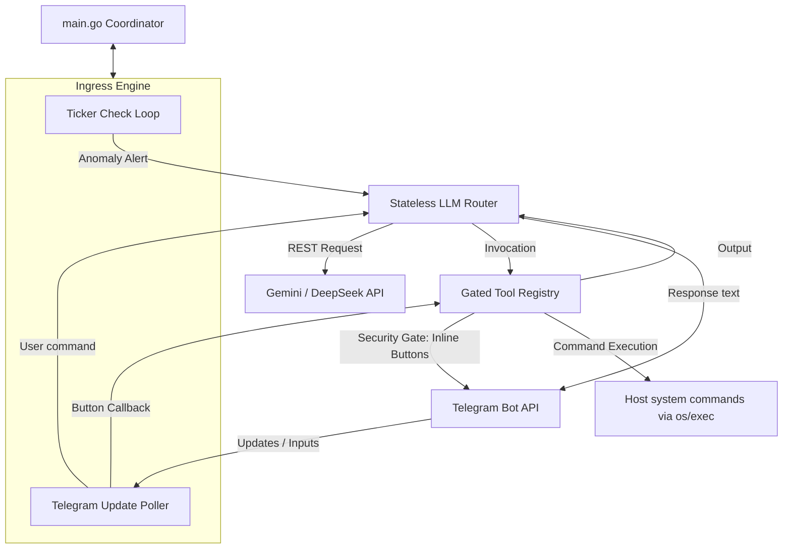

# MicroClaw NAS Watchdog Daemon

MicroClaw is a hyper-lightweight, autonomous NAS watchdog daemon written in pure Go. It monitors system resources (CPU, Memory, Disk space), tracks Docker container statuses, and allows interactive troubleshooting through an LLM agent on Telegram. 

## Architectural Philosophy
1. **Zero Bloat**: No heavy AI frameworks (no LangChain, CrewAI ports) and no heavy web frameworks (no Gin, Fiber). Relies strictly on Go's standard library (`net/http`, `encoding/json`, `context`, goroutines).
2. **Interactive Security Gating**: Actions are separated into read-only (executed immediately) and state-changing (requires manual confirmation via Telegram inline keyboards).
3. **Stateless Multi-Model Routing**: Supports both Gemini (using `/generateContent`) and DeepSeek / OpenAI (using `/chat/completions`) REST protocols.

---

## Component Topology



---

## Directory Structure

* **`/cmd/nas-watchdog`**
  * `main.go`: Daemon entrypoint orchestrating goroutines, handling OS interrupts, routing Telegram slash commands, and processing anomaly alerts.
* **`/internal/config`**
  * `config.go`: Environment configurations parser.
* **`/internal/metrics`**
  * `metrics.go`: High-performance, zero-subprocess hardware resources collector (CPU, memory, storage usage, and top processes).
* **`/internal/telegram`**
  * `client.go`: Low-level Telegram Bot API wrapper mapping updates polling, sending messages, and updating markdown buttons.
* **`/internal/agent`**
  * `agent.go`: REST-based AI router managing state translations (Gemini/OpenAI), pruning short-term memory, routing offline fallback responses, and writing logs to append-only JSONL files.
* **`/internal/tools`**
  * `registry.go`: Map of execution modules separating read-only queries from state-changing operations requiring Telegram callbacks.

---

## Interactive Slash Commands

To save LLM API costs and request information instantly, MicroClaw intercepts commands starting with `/` and resolves them locally (bypassing the AI Agent router):

* `/stats` - Instantly prints host CPU, memory, storage metrics, and the top CPU-consuming processes.
* `/status` - Outputs a table of all active and inactive Docker containers.
* `/reset` - Clears the current LLM conversation memory.
* `/help` - Renders the helper command catalog.

---

## Security Model & Tool Separation

### 1. Read-Only (Unconditional execution)
* `get_docker_stats()`: Reads resource loads of all running containers.
* `get_container_logs(name, tail)`: Fetches trailing docker logs.
* `check_zpool_status()`: Queries system `zpool status` metrics.
* `get_disk_usage()`: Evaluates filesystem usage via `df -h`.
* `search_past_logs(query)`: RAG-style query tool that searches the append-only `.jsonl` history logs file on disk for matching keywords.

### 2. State-Changing (Approval-Gated)
* `restart_container(name)`
* `stop_container(name)`

**Approval Lifecycle**:
1. Agent decides to call `restart_container(name="db")`.
2. Registry interrupts agent lifecycle thread, compiles action payload, and sends Telegram keyboard markup.
3. User selects `[Approve]` or `[Reject]`.
4. Bot receives update callback, forwards resolution status to registry, removes UI buttons, and either resumes command execution or cancels safely.

---

## Proactive Triaging & Offline Resilience

### 1. Proactive Self-Diagnostics
When a resource threshold is breached (e.g. CPU > 80%), the daemon doesn't just notify you of the breach. It automatically runs a `top` analysis, extracts the resource-hogging processes/containers, and appends this context to the anomaly payload before starting the LLM diagnostic routing loop.

### 2. Offline Failsafe Loop
If the LLM provider (Gemini or DeepSeek) is down, rate-limited, or if the NAS network disconnects from the WAN:
* The daemon catches the API error.
* It bypasses the AI routing step and executes a local metrics query.
* It sends a direct Telegram warning containing your current hardware load and active process diagnostics so you can resolve the issue manually.

---

## Running Locally (Without Docker)

You can run and test the daemon locally on any Linux host directly using Go:

1. Clone or copy the project files to your directory.
2. Edit [run_local.sh](file:///home/rhea/workspace/micro-claw/run_local.sh) to input your API credentials and Telegram user ID.
3. Start the daemon:
   ```bash
   ./run_local.sh
   ```
   *Note: In local mode, the daemon checks `/proc` statistics directly on your test machine. The monitoring checks run at a speed-up interval of 1 minute (instead of 5 minutes) for quick testing loops.*

---

## Deploying (With Docker)

1. Compile the Multi-stage Docker image and start the compose suite:
   ```bash
   docker compose up -d --build
   ```

2. Make sure you map the appropriate volumes inside your host configuration to grant access to container sockets and mount targets:
   - `/var/run/docker.sock:/var/run/docker.sock:ro` (Allows executing docker stats / logs commands)
   - `/:/host:ro` (Permits checking host-level storage volume limits)
   - `./data:/app/data` (Stores persistent history logs `.jsonl` files)
